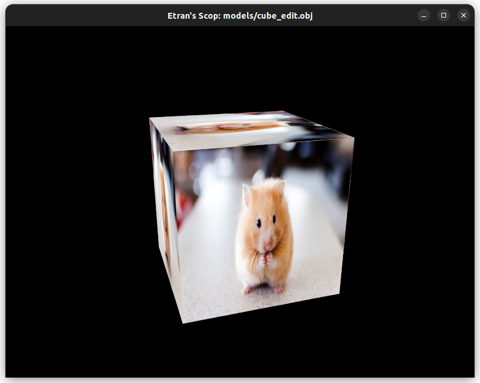
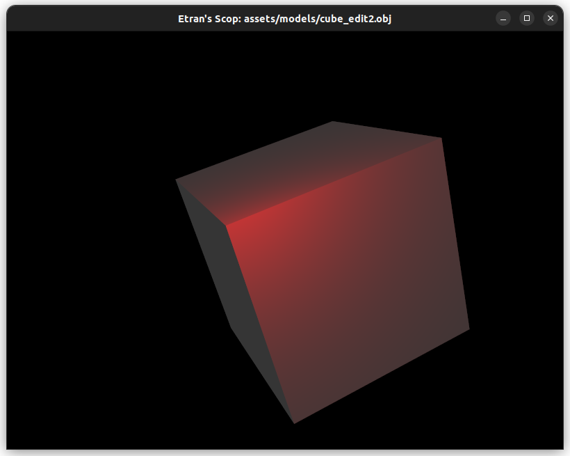
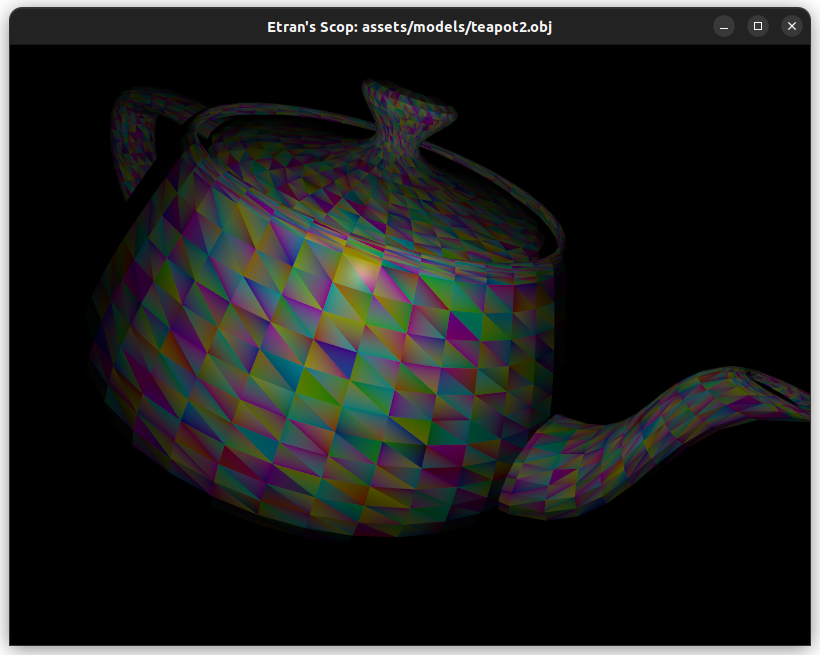

# scop
A simple graphics `.obj` renderer, made with Vulkan.

## Usage
`./scop filepath`

You can press `escape` to close the window.

**Texture enabling keys**:
- `t`		changes texture (texture -> color -> grayscale)

**Light selector**
- `l`		changes light spot position
- `k`		changes light spot color

**Object moving keys**
- `w`		forward
- `s`		backward
- `a`		left hand side
- `d`		right hand side
- `ctrl`	downward
- `space`	upward

**Rotation keys**:
- `1`		around X axis of the object (`7` to rotate counter clockwise)
- `2`		around Y axis of the object (`8` to rotate counter clockwise)
- `3`		around Z axis of the object (`9` to rotate counter clockwise)

**Reset model edits**
- `r`		reset model

**Camera orientation keys**
- `tab`		camera orientation: +90°, 0° or -90°

**Zoom scroll**
- `up/down`	zoom in/out
- `press`	reset zoom

## Examples

**Basic cube**

**Cube rotated with red spotlight**

**Teapot with colored faces**

### Bonus implemented
- Zoom
- Diffuse shading
- Specular lighting
- .mtl files parsing
- Enhanced user experience, camera orientation & spot selector

## Awesome resources

**Wavefront .obj format:**
https://www.loc.gov/preservation/digital/formats/fdd/fdd000507.shtml

**Wavefront mtl format:**
https://www.loc.gov/preservation/digital/formats/fdd/fdd000508.shtml
