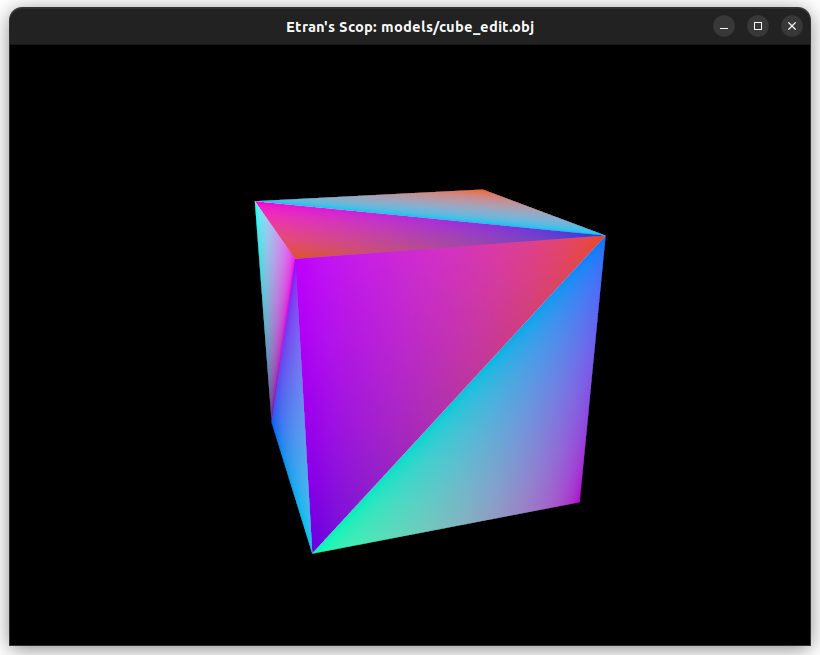
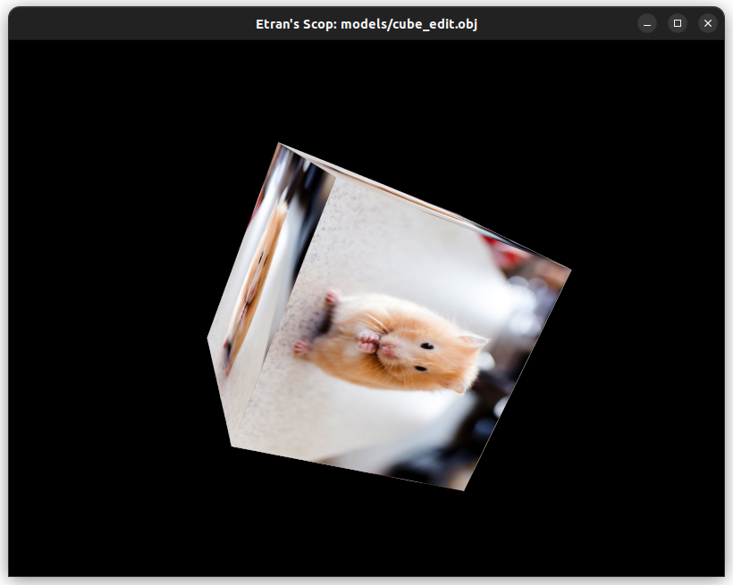
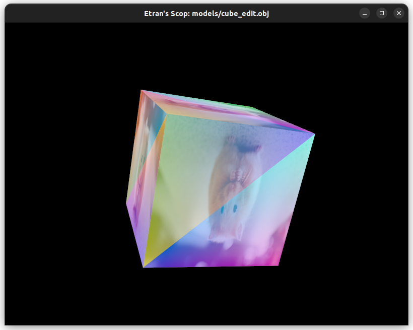

# scop
A simple graphics `.obj` renderer, made with Vulkan.

## Usage
`./scop filepath {texturepath}`

**Texture enabling**:
- `Space`	toggles/untoggles texture

**Rotation keys**:
- `1`	axis X
- `2`	axis Y
- `3`	axis Z
- `4`	disable rotation

**Zoom**
- `scroll up/down`	zoom in/out
- `scroll press`	reset zoom

## Examples

**Basic cube**

**Color toggled**

**Rotation toggled**

**Color toggled while rotating**
